# AMR 무선 관제 및 예지보전 시스템 (완료)

> **무엇을** — 소형 AMR(자율주행 로봇)을 원격 관제하고, 모터 전류로 이상을 예지보전하는 엣지-클라우드 시스템
> **무슨 기술로** — Arduino(펌웨어) · C# WinForms/Python(관제·분석) · TCP/IP socket · C++/MFC 포팅
> **어떤 성능으로** — 전류 기반 3-클래스 진단 **정확도 96.5%**, 이물질 **재현율 100%** (실측 CSV 1,144 윈도우, 슬라이딩 윈도우 W=20 재현 검증)

**✅ 프로젝트 1 완료.** 유선 통신 → 무선 전환 → 안전로직 → 예지보전 → TCP/IP 원격 관제 → **C++/MFC 포팅**까지 완료했습니다. 자율주행(ROS·SLAM) 등 후속 확장은 프로젝트 2에서 진행합니다.

<p align="center">
  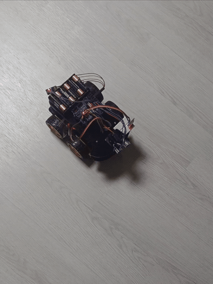<br>
  <sub><b>데모:</b> 정상 주행 중 이물질 감지 → 자동 정지 → 서보(초음파) 좌우 경고</sub>
</p>

---

## 프로젝트 개요

반도체·제조 장비 SW의 관제 구조를 소형 AMR로 구현한 학습·포트폴리오 프로젝트입니다.
"AI 없이도 완벽히 동작하는 시스템"을 먼저 구축하고, 그 위에 예지보전과 원격 관제를 얹은 뒤,
같은 관제 시스템을 **C++/MFC로 다시 구현(포팅)** 하여 마무리했습니다.

| 구분 | 내용 |
|---|---|
| **엣지 (로봇)** | Arduino Uno + 4WD 스마트카 · 초음파/전류 센서 · 서보 · HC-06 블루투스 |
| **클라우드 (PC)** | C# WinForms 관제 GUI · Python 데이터 분석 · **C++/MFC 관제 (포팅)** |
| **통신** | 커스텀 바이너리 패킷 프로토콜 (XOR 체크섬) · 블루투스 · TCP/IP socket |
| **안전** | 하트비트 워치독 (통신 두절 시 자율 정지) |
| **예지보전** | 모터 전류(MCSA) 기반 이상 감지 → 유형 진단 → 자동 대응 |
| **원격 관제** | TCP/IP socket 기반 브릿지 구조 · 양방향 · 멀티스레드 |

---

## 시스템 구조

```
[WinForms 관제]  ← GUI · 실시간 그래프 · 예지보전 · 진단 · 자동대응
      ↓  TCP/IP socket (네트워크)
[브릿지]         ← 하트비트 유지 · 명령/센서 양방향 중계
      ↓  시리얼 / 블루투스
[로봇]           ← 전류 측정 · 워치독 · 서보 경고
```

관제(원격 PC)와 로봇을 브릿지가 잇는 산업 AMR 중앙관제 구조. 통신 계층(시리얼↔socket)을
교체해도 패킷 프로토콜을 그대로 재사용하도록 계층을 분리 설계했습니다.
이 계층 분리 설계 덕분에, 이후 관제 클라이언트를 **C# → C++/MFC로 교체**할 때도
동일한 패킷 프로토콜을 그대로 재사용할 수 있었습니다.

---

## 주요 기능

### 실시간 관제
- PC에서 로봇 방향 제어 (전/후/좌/우/정지, 비상정지)
- 초음파 거리 · 모터 전류 실시간 수신 및 그래프 표시 (GDI+ 직접 렌더링)
- 수신 스레드 분리 + UI 스레드 마샬링(Invoke)으로 안정적 실시간 갱신

<p align="center">
  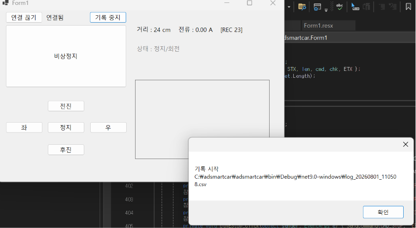<br>
  <sub>C# WinForms 관제 화면 — 거리·전류 실시간 표시 + CSV 로깅</sub>
</p>

### 커스텀 패킷 프로토콜
```
[STX=0x02] [LEN] [CMD] [DATA...] [CHK] [ETX=0x03]
```
- CMD 대역 분리: `0x1_` 명령 / `0x2_` 센서 / `0x3_` 제어 / `0x4_` 예지보전 대응
- XOR 체크섬으로 데이터 손상 탐지
- 조각나서 도착하는 데이터를 상태 기반 조립기로 재조립
- **전송 계층 독립** — 시리얼과 TCP/IP socket 양쪽에서 동일 프로토콜 재사용

### 워치독 안전로직
- 100ms마다 하트비트 전송, 로봇이 미수신 시 **스스로 정지** (자율 안전장치)
- 원격 관제 시에는 브릿지가 하트비트를 담당하여 연결 유지

### 예지보전 (감지 → 진단 → 대응)
- ACS712 전류센서 통합, 드리프트 대응 동적 영점 보정
- Python으로 정상/부하/이물질 데이터 분석 → 유형별 고유 특징 규명

  | 상태 | 평균 (`current_diff`) | 표준편차 |
  |---|---|---|
  | 정상 | 8.07 | 2.70 |
  | 부하(무게) | 10.19 | 1.50 |
  | 이물질(마찰) | 14.36 | 2.28 |

  > `current_diff` = 주행 구간의 모터 전류 변화량 지표. 값은 ACS712 → ADC 경로에서 산출되며,
  > 절대 물리 단위(mA)로의 환산 없이 **상대 지표**로 사용합니다. (정상/부하/이물질의 상대 비교가 목적)

- **이상 감지:** 이동평균 기반 실시간 판단 (직진/후진 구간)
- **유형 진단:** 평균 + 표준편차로 부하 이상 / 이물질·마찰 구분
- **자동 대응:** 부하는 경고 표시, 이물질 지속 시 자동 정지 + 서보 좌우 경고

#### 진단 성능 (실측 검증)

실측 CSV(정상/부하/이물질 각 FORWARD 구간)에 판정 로직을 적용해 **재현한** 결과입니다.
판정은 `current_diff`의 **슬라이딩 윈도우(W=20, 겹침) 평균**을 경계값으로 분류합니다.
경계값은 각 상태 분포의 중간점을 근거로 설정했습니다 (정상/부하 = 9.5, 부하/이물질 = 12.0).
전체 재현 코드는 [`analysis/classify.py`](analysis/classify.py) 참조.

**혼동 행렬** (행: 실제 / 열: 예측, 단위: 윈도우 개수)

| 실제 \ 예측 | 정상 | 부하 | 이물질 |
|---|---|---|---|
| **정상** | 336 | 16 | 0 |
| **부하** | 24 | 301 | 0 |
| **이물질** | 0 | 0 | 467 |

- **전체 정확도 96.5%** — 1,144개 윈도우 중 1,104개 정답
- **이물질 재현율 100%** — 이물질을 단 한 번도 놓치지 않음 (467/467)
- **정상 오탐률 4.5%** — 정상을 이상으로 잘못 알린 비율 (16/352)

> 안전이 중요한 예지보전에서 "이상을 놓치지 않는 것(재현율)"을 최우선으로 설계했습니다.
> 가장 위험한 이물질/마찰은 재현율 100%로 전수 검출하며, 정상 오탐은 4.5%로 억제했습니다.
> (약 2분 분량 실측 데이터 기반의 개념 검증(PoC)이며, 정량 성능의 일반화는 데이터 확대와 함께 향후 과제입니다.)

<p align="center">
  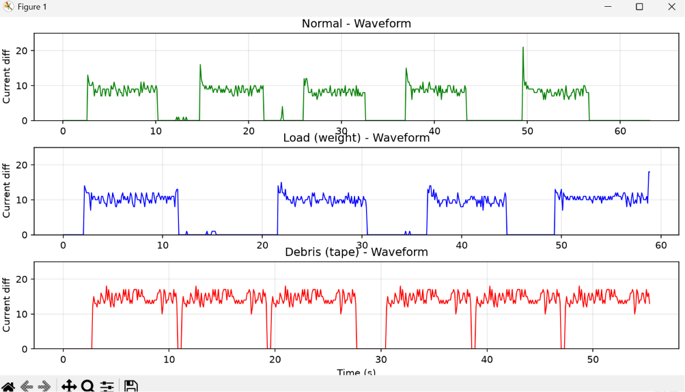<br>
  <sub>Python 분석 — 정상/부하/이물질 3상태 전류 파형 비교</sub>
</p>

<p align="center">
  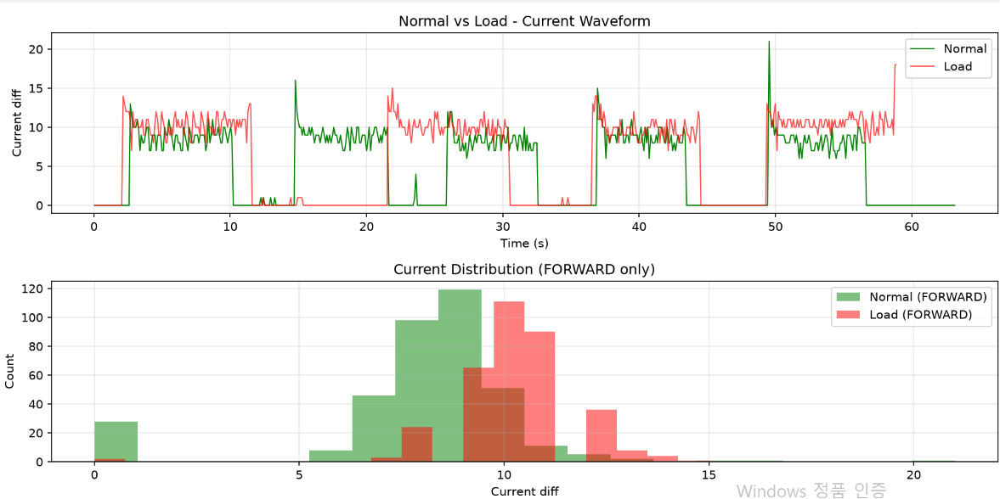<br>
  <sub>정상 vs 부하 전류 분포 — 부하 시 분포가 고전류 쪽으로 이동</sub>
</p>

실측 데이터로 도출한 유형별 특징을 실시간 관제에 이식하여, GUI가 주행 중
전류를 분석해 상태를 자동 판정합니다.

<p align="center">
  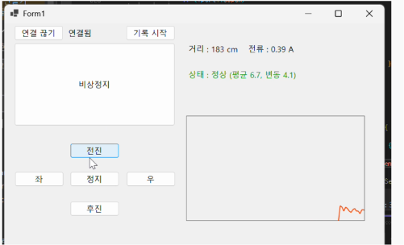<br>
  <sub>실시간 판정 — 정상 (평균 6.7, 변동 4.1)</sub>
</p>

<p align="center">
  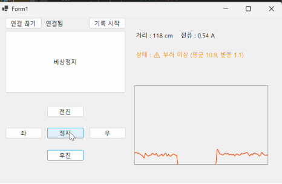<br>
  <sub>실시간 판정 — 부하 이상 (평균 10.9, 변동 1.1)</sub>
</p>

<p align="center">
  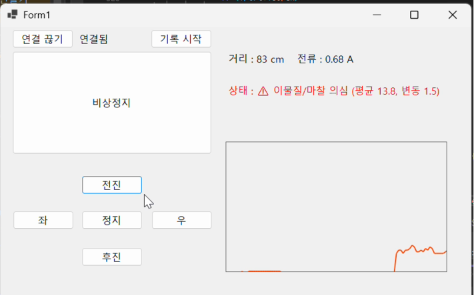<br>
  <sub>실시간 판정 — 이물질/마찰 의심 (평균 13.8, 변동 1.5)</sub>
</p>

<p align="center">
  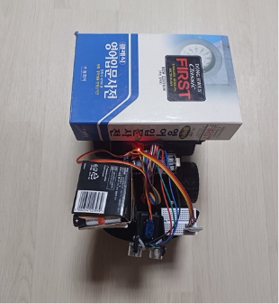<br>
  <sub>실물 부하 테스트 — 로봇에 무게를 올려 전류 상승 유도</sub>
</p>

### TCP/IP 원격 관제
- socket 기반 브릿지 구조로 원격 PC에서 로봇 조종·모니터링
- 명령(관제→로봇)과 센서(로봇→관제) **양방향** 통신
- 브릿지가 명령 중계·센서 중계·하트비트를 **멀티스레드**로 동시 처리
- 통신 계층만 교체하여 기존 관제 기능(그래프·예지보전)을 그대로 재사용

<p align="center">
  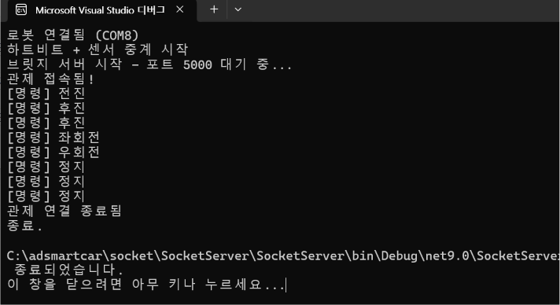<br>
  <sub>C# 브릿지 서버 — 로봇 연결·관제 접속·명령 중계 로그</sub>
</p>

---

## C++/MFC 포팅

취업 목표(반도체 장비 제어·AGV SW 개발)의 요구 기술인 **C++ / MFC** 역량을 확보하기 위해,
이미 C#으로 완성한 관제 시스템을 C++/MFC로 다시 구현했습니다.
같은 시스템을 두 언어로 구현함으로써 **언어에 종속되지 않는 설계 이해**를 보여주는 것이 목표입니다.

단계적 검증 원칙에 따라 콘솔 → 소켓 → GUI 순서로 진행했습니다.

| 단계 | 내용 | 결과물 |
|---|---|---|
| **1. 콘솔** | 커스텀 패킷 프로토콜(빌드·파싱·XOR 체크섬)을 C++로 이식 | `cpp/PacketTest` |
| **2. Winsock** | TCP 서버/클라이언트로 실제 패킷 송수신 (에코 통신) | `cpp/EchoServer`, `cpp/EchoClient` |
| **3. MFC GUI** | 대화상자 기반 관제 — 버튼 클릭 → 패킷 전송 → 에코 수신·로그 | `cpp/MfcControl` |

- **패킷 프로토콜 재사용:** C#에서 설계한 `[STX][LEN][CMD][DATA][CHK][ETX]` 구조를
  C++로 포팅. `Packet.h`/`Packet.cpp`로 분리하여 콘솔·서버·GUI 세 프로젝트에서 공통 사용
- **Winsock 소켓 통신:** C#의 `System.Net.Sockets`에 대응하는 Winsock2 API로
  초기화·연결·송수신·정리 전 과정 직접 구현
- **MFC 대화상자 관제:** 방향 제어 버튼(전/후/좌/우/정지) → CMD 패킷 전송,
  연결/해제 및 상태 표시, 수신 로그 출력. C# WinForms 관제의 핵심 조작 화면을 재현

<p align="center">
  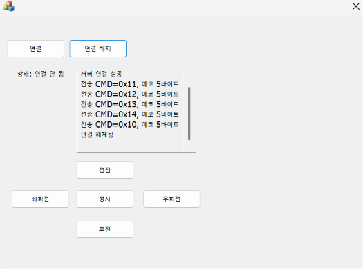<br>
  <sub>C++ MFC 관제 GUI — 버튼 클릭 시 CMD 패킷 전송, 에코 수신 로그</sub>
</p>

<p align="center">
  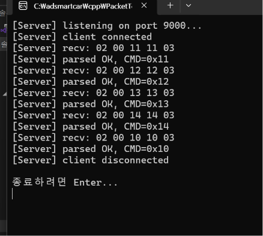<br>
  <sub>C++ Winsock 서버 — MFC 관제가 보낸 패킷 수신·파싱</sub>
</p>

> 같은 프로토콜을 사용하므로 언어가 달라도 상호 통신이 가능합니다.
> (C# 관제 ↔ C# 브릿지, C++ MFC 관제 ↔ C++ 서버 모두 동일 패킷 규격)

---

## 기술 스택

| 영역 | 사용 기술 |
|---|---|
| 펌웨어 | Arduino (C/C++), 비블로킹 상태머신, SoftwareSerial, Servo |
| 관제 SW (C#) | C# WinForms, System.IO.Ports, System.Net.Sockets |
| 관제 SW (C++) | C++, MFC (대화상자), Winsock2 |
| 동시성 | 멀티스레드, UI 마샬링(Invoke) |
| 시각화 | GDI+ (더블 버퍼링) |
| 데이터 분석 | Python (pandas, numpy, matplotlib) |
| 통신 | 커스텀 패킷 프로토콜, HC-06 Bluetooth, TCP/IP socket |
| 형상관리 | Git / GitHub |

---

## 저장소 구조

```
├── adsmartcar/      # C# WinForms 관제 프로그램
├── analysis/        # Python 데이터 분석 · 예지보전
│   ├── data/        #   수집한 전류 데이터 (CSV)
│   ├── analyze.py   #   통계·파형 분석 스크립트
│   └── classify.py  #   W=20 판정 로직 + 혼동행렬 재현
├── socket/          # TCP/IP 원격 관제 (C#)
│   ├── SocketServer/  #   브릿지 (socket ↔ 시리얼)
│   └── SocketClient/  #   관제 클라이언트 (콘솔 프로토타입)
├── cpp/             # C++/MFC 포팅
│   ├── PacketTest/    #   1단계 — 콘솔 패킷 빌더/파서
│   ├── EchoServer/    #   2단계 — Winsock 서버
│   ├── EchoClient/    #   2단계 — Winsock 클라이언트
│   └── MfcControl/    #   3단계 — MFC 관제 GUI
└── (firmware)       # Arduino 펌웨어
```

---

## 진행 현황

### 프로젝트 1 (완료)
- [x] C# 관제 GUI + 실시간 그래프
- [x] USB 유선 통신 (송수신)
- [x] 커스텀 패킷 프로토콜 (양방향 + 체크섬)
- [x] HC-06 블루투스 무선 전환
- [x] 하트비트 워치독
- [x] 전류센서 통합 + 데이터 로깅
- [x] Python 데이터 분석
- [x] 실시간 이상 감지 + 유형 진단
- [x] 심각도별 자동 대응 (경고 / 자동 정지 + 서보)
- [x] TCP/IP socket 원격 관제 (양방향, 멀티스레드)
- [x] C++/MFC 포팅 (콘솔 → Winsock → MFC GUI)

### 프로젝트 2 (예정) — ROS·SLAM 자율주행
- [ ] ROS + 라즈베리파이 + LiDAR 기반 자율주행
- [ ] SLAM 지도 작성 및 경로 계획
- [ ] 배터리 전압 모니터링
- [ ] 이상 이벤트 로그 기록
- [ ] 머신러닝 기반 탐지 고도화
- [ ] YOLO 카메라 비상정지

---

## 설계 원칙

1. **역할 분리** — 로봇은 실행, PC는 판단·예지보전
2. **유선 우선, 무선/네트워크는 나중** — 검증된 토대 위에 확장
3. **단계적 검증** — 한 방향씩 검증하여 문제 원인 격리
4. **계층 분리** — 애플리케이션 프로토콜을 전송 수단과 독립 설계 (시리얼↔socket, C#↔C++ 재사용)
5. **데이터 기반 의사결정** — 임계값 등을 실측 분석으로 도출
